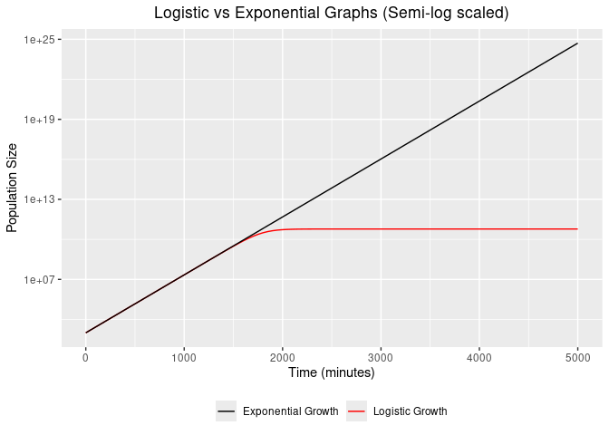

# Logistic Growth


The first three questions are explored in this Markdown File developed
using Quarto (README.qmd).

------------------------------------------------------------------------

# Question 1

## Plotting Data

Throughout the project, we are using data from `experiment.csv`. We
start our analysis by considering the standard Time vs Population plot
and the semi-log transformed Time vs Population plot (Population axis
transformed), generated by the following script (`plot_data.R`):

``` r
growth_data <- read.csv("experiment.csv")

install.packages("ggplot2")
library(ggplot2)

#Standard Time vs Population Plot
ggplot(aes(t,N), data = growth_data) +
  
  geom_point() +
  
  xlab("t") +
  
  ylab("y") +
  
  theme_bw()
```


``` r
#Semi-log plot
ggplot(aes(t,N), data = growth_data) +
  
  geom_point() +
  
  xlab("t") +
  
  ylab("y") +
  
  scale_y_continuous(trans='log10')
```


Since both plots are very sensitive to scale (it is very hard to see
deviations in the points on the extremes), we include interactive
versions of both plots at \[\].

## Fitting Linear Models

It is easy (especially with the interactive plots) to notice that in the
first plot, the beginning (t \< 1500) is very similar to an exponential
function and the ending (t \> 2500) is very similar to a constant
function. Equivalently, the second plot has an increasing linear
beginning and a constant ending.

This motivates a simple approach to fit a logistic function, by fitting
the linear and constant portions separately, then we evaluate various
statistics in the context of linear models. By doing a grid search
(intervals of 50) on boundary values and comparing t-values (p-values
have became too low), I determined that t \< 1550 and t \> 4000 would be
the way to split that gave the most accurate results.

If we wanted to improve reproducibility or flexibility to different
datasets, a better idea would be to do a logistic regression directly
instead of manually identifying suitable bounds.

Now we present the code used to fit the data (`fit_linear_model.R`):

``` r
#Script to estimate the model parameters using a linear approximation

install.packages("dplyr")
library(dplyr)

#We assume the programs are run in series -- no need to re-read the data file
#growth_data <- read.csv("experiment.csv")


#This is not actually a great way to do the fitting, since it is not very reusable
#   (for example, if we change the data). A better way would be to do a logistic 
#   regression directly by minimizing squared loss, but that would require
#   numerical optimization techniques.
#Case 1. K >> N0, t is small

data_subset1 <- growth_data %>% filter(t<1550) %>% mutate(N_log = log(N))

model1 <- lm(N_log ~ t, data_subset1)
#Case 2. N(t) = K

data_subset2 <- growth_data %>% filter(t>4000)

model2 <- lm(N ~ 1, data_subset2)
```

We can use the following code (included in the actual code) to inspect
the model and its statistics:

``` r
summary(model1)
```


    Call:
    lm(formula = N_log ~ t, data = data_subset1)

    Residuals:
          Min        1Q    Median        3Q       Max 
    -0.118972  0.004152  0.008651  0.009060  0.042125 

    Coefficients:
                 Estimate Std. Error t value Pr(>|t|)    
    (Intercept) 6.898e+00  1.138e-02   606.1   <2e-16 ***
    t           1.000e-02  1.301e-05   768.7   <2e-16 ***
    ---
    Signif. codes:  0 '***' 0.001 '**' 0.01 '*' 0.05 '.' 0.1 ' ' 1

    Residual standard error: 0.02985 on 24 degrees of freedom
    Multiple R-squared:      1, Adjusted R-squared:      1 
    F-statistic: 5.908e+05 on 1 and 24 DF,  p-value: < 2.2e-16

``` r
summary(model2)
```


    Call:
    lm(formula = N ~ 1, data = data_subset2)

    Residuals:
        Min      1Q  Median      3Q     Max 
    -141.65  -39.65  -19.65   27.35  204.35 

    Coefficients:
                 Estimate Std. Error   t value Pr(>|t|)    
    (Intercept) 6.000e+10  2.175e+01 2.759e+09   <2e-16 ***
    ---
    Signif. codes:  0 '***' 0.001 '**' 0.01 '*' 0.05 '.' 0.1 ' ' 1

    Residual standard error: 89.67 on 16 degrees of freedom

We are happy with these results. Now we will plot them with our original
data.

## Plotting the Models

We extract the coefficients directly from “model1” and “model2” (instead
of inspecting the coefficients), improving reproducibility and
flexibility of the program. The following is the code for both the
logistic and semi-log plots. (`plot_data_and_model.R`)

``` r
#Script to plot data and model

#growth_data <- read.csv("experiment.csv")

logistic_fun <- function(t) {
  
  N <- (N0*K*exp(r*t))/(K-N0+N0*exp(r*t))
  
  return(N)
  
}
#This increases flexibility/mutability
N0 <- exp(coef(model1)[1]) #
  
r <- coef(model1)[2] #
  
K <- coef(model2)[1] #

ggplot(aes(t,N), data = growth_data) +
  
  geom_function(fun=logistic_fun, colour="red") +
  
  geom_point()
```


``` r
  #scale_y_continuous(trans='log10')


ggplot(aes(t,N), data = growth_data) +
  
  geom_function(fun=logistic_fun, colour="red") +
  
  geom_point() +

  scale_y_continuous(trans='log10')
```


## Results

Here we present the results given by the summary() functions. We
consider the linear and constant portions seperately.

### Case 1: $K >> N_0$, $t < 1550$ (linear)

IN this case, the logistic function is very similar to an exponential
function. After the transformation, the function we are fitting is
approximately $\log(N_0\cdot{e^{rt}}) = \log({N_0}) + r\cdot{t}$. The
coefficients given by `summary(model1)` are: 

$$
\log({N_0}) = 6.898
$$ 

$$
r = 0.01
$$ 

And hence

$$
N_0 = \exp(6.898) = 990
$$

### Case 2: $t > 4000$

In this case, the function becomes near constant. Here,
`summary(model2)` gives us a good approximation to the value:

$$
K = 6.00\cdot10^{10}
$$

------------------------------------------------------------------------

# Question 2

The exponential function given by fitting when $t < 1550$ is

$$
F(t) = N_0\cdot{e^{rt}}
$$ 

Hence, the population at $t = 4980$ given by the exponential function
is: 

$$
F(4980) = 990\cdot{e^{0.01\cdot{4980}}} = 4.20\cdot10^{24}
$$ 

The logistic funtion, is given by 

$$
N(t) = \frac{KN_0e^{rt}}{K-N_0+N_0e^{rt}}
$$ 

Hence, 

$$
N(4980) = \frac{6.00\cdot{10^{10}}\cdot{990}\cdot{e^{0.01\cdot{4980}}}}{6.00\cdot{10^{10}}-990+990\cdot{e^{0.01\cdot{4980}}}} = 6.00\cdot{10^{10}}
$$ 

Which is expected as $t = 4980$ is on the “constant” portion of the
graph and so will be extremely close to $K$.

The difference between the two approximations is:

$$
\frac{F(4980)}{N(4980)} = 7.00\cdot{10^{13}}
$$ 

As we can see, the exponential model becomes many orders larger than
the logistic model when t is large.

------------------------------------------------------------------------

# Question 3

As with before, most of the plots are quite scale-sensitive, so we will
include an interactive version of each plot too. Once again, we assume
this script will be run after the previous scripts have, so all
variables will be defined already. We will have one direct comparison of
the exact functions and one which is semi-log transformed. For the first
plot, we will only show a snippet for
$N_0 < \text{Population Size} < 3\cdot{K}$ to deal with scale
differences. The second plot is more informative.

Here is the code that produces the non-interactive plots
(`logistic_vs_exponential_plots.R`):

``` r
#Definition of exponential function
exponential_fun <- function(t) {
  
  Nt <- N0*exp(r*t)
  
  return(Nt)
  
}

#For Scale reasons, we only show the plot between N0 < Population_Size < 3*K Refer to the interactive version for the full plot.
ggplot() +
  
  geom_function(aes(color = "Logistic Growth"), fun=logistic_fun) +
  
  geom_function(aes(color = "Exponential Growth"), fun=exponential_fun) +
  
  xlim(0, 5000) +
  
  ylim(N0, 3*K) +
  
  xlab("Time (minutes)") +
  
  ylab("Population Size") +
  
  ggtitle("Logistic vs Exponential Graphs") +
  
  scale_color_manual(values = c("Logistic Growth" = "red", 
                                "Exponential Growth" = "black")) +
  
  theme(plot.title = element_text(hjust = 0.5),
        legend.title = element_blank(),  
        legend.position = "bottom") +
  
  geom_point()
```


``` r
#The Semi-Log plot comparison is better for Comparison

ggplot() +
  
  geom_function(aes(color = "Logistic Growth"), fun=logistic_fun) +
  
  geom_function(aes(color = "Exponential Growth"), fun=exponential_fun) +
  
  xlim(0, 5000) +
  
  scale_y_continuous(trans='log10') + 
  
  xlab("Time (minutes)") +
  
  ylab("Population Size") +
  
  ggtitle("Logistic vs Exponential Graphs (Semi-log scaled)") +
  
  scale_color_manual(values = c("Logistic Growth" = "red", 
                                "Exponential Growth" = "black")) +
  
  theme(plot.title = element_text(hjust = 0.5),
        legend.title = element_blank(),  
        legend.position = "bottom") +
  
  geom_point()
```



Interactive plots can be found here: \[\]

------------------------------------------------------------------------
