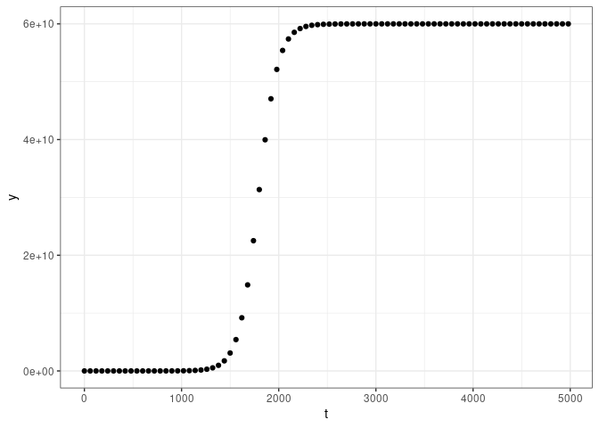
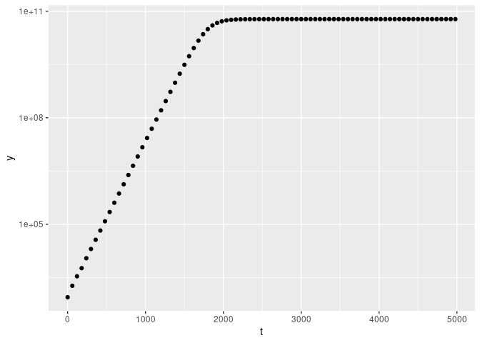

# Logistic Growth


The first three Questions are explored in this Quarto Markdown File.

------------------------------------------------------------------------

# Question 1

We start our analysis by considering the Time vs Population and Time vs
log-Population, generated by the following script:

``` r
#Script to plot the logistic growth data

growth_data <- read.csv("experiment.csv")

install.packages("ggplot2")
```

    Installing package into '/cloud/lib/x86_64-pc-linux-gnu-library/4.4'
    (as 'lib' is unspecified)

``` r
library(ggplot2)

ggplot(aes(t,N), data = growth_data) +
  
  geom_point() +
  
  xlab("t") +
  
  ylab("y") +
  
  theme_bw()
```



``` r
ggplot(aes(t,N), data = growth_data) +
  
  geom_point() +
  
  xlab("t") +
  
  ylab("y") +
  
  scale_y_continuous(trans='log10')
```



------------------------------------------------------------------------

# Question 2

------------------------------------------------------------------------

# Question 3

------------------------------------------------------------------------
